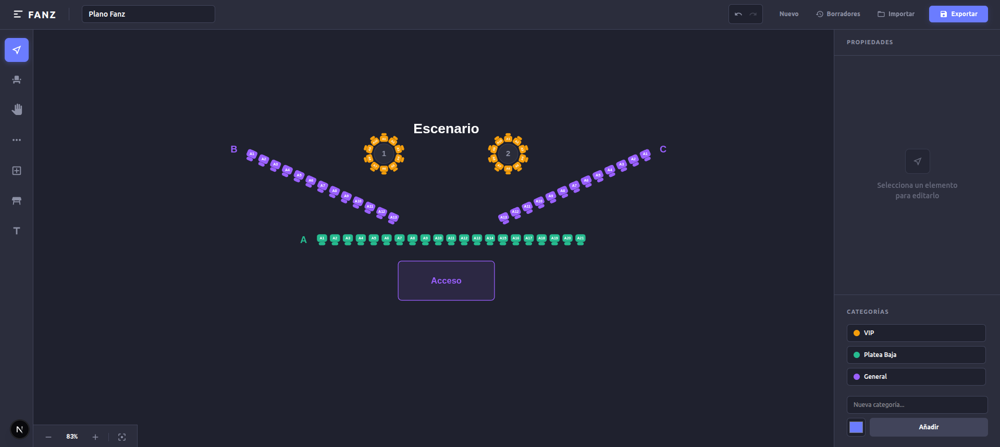

# Seat Map Builder (Fanz)



Un editor visual interactivo para diseñar mapas de asientos, construido con React, TypeScript, Next.js, Zustand y React-Konva.

## 🚀 Instalación y Ejecución

El proyecto, al ser pequeño, está diseñado para ejecutarse completamente en memoria sin necesidad de un backend o base de datos externa.

```bash
# Instalar dependencias
npm install

# Iniciar servidor de desarrollo
npm run dev
```

Abre [http://localhost:3000](http://localhost:3000) en tu navegador para ver la aplicación.

## 🎯 Requerimientos MVP Cumplidos

### 1. Visualización
El mapa permite dibujar con precisión matemática Áreas, Textos, Filas de asientos y Mesas circulares. Todo renderizado en un Canvas 2D de alto rendimiento usando Konva.js. Soporta Zoom (Rueda del mouse) y Paneo (Herramienta Mano o Espacio + Arrastrar).

### 2. Gestión de Filas y Asientos
- **Dibujo Geométrico:** Las filas y áreas se dibujan con un modelo de interacción de 3 clicks (Click para iniciar, mover para dimensionar, Click para finalizar), con "Ghost Elements" y previsualizaciones en tiempo real.
- **Configuración:** La cantidad de asientos se puede modificar desde el Inspector lateral en tiempo real o arrastrando al editar.
- **Selecciones Complejas:** Soporte completo para selección múltiple manual (Click + Shift) o mediante caja delimitadora (AABB Bounding Box).
- **Eliminación Segura:** Borrar cualquier elemento dispara un Modal Customizado (sin usar `window.confirm` nativo) garantizando seguridad contra clics accidentales.

### 3. Etiquetado Avanzado
- **Etiquetado Rápido por Lotes:** Al seleccionar múltiples elementos (como Múltiples Filas o docenas de asientos sueltos), el motor permite nombrar filas de la A a la Z, y numerar asientos dinámicamente.
- **Orden Visual Absoluto:** El motor matemático evalúa la posición visual real en pantalla de cada asiento seleccionado de Izquierda a Derecha para aplicar la numeración secuencial perfecta (ej: `A1` ... `A50`), sin importar en qué ángulo fueron dibujadas las filas originales.
- **Validaciones:** Se aplican constraints visuales a todas las etiquetas para garantizar que nombres de áreas, textos o prefijos estén presentes.

### 4. Flujo de Sesión (Import/Export)
- El header superior cuenta con **Nuevo Mapa** (Limpia toda la sesión).
- **Guardar / Exportar:** Exporta el stage interno a un archivo `.json` puro.
- **Cargar / Importar:** Lee el archivo `.json` restaurando la interactividad del lienzo instantáneamente gracias a la arquitectura de estado de Zustand.

## 🛠 Decisiones Técnicas Relevantes

1. **Gestor de Estado (Zustand):**
   Elegido sobre Context API o Redux por su cero repintado (zero-boilerplate) y la facilidad extrema para leer estados de forma imperativa fuera del ciclo reactivo (ideal para eventos intensos de 60fps de Konva como `onMouseMove`).

2. **Motor Gráfico (React-Konva):**
   Para lograr la experiencia robusta de "Seats.io" era mandatorio salir del DOM tradicional y usar HTML5 Canvas. React-Konva nos permite mantener una sintaxis declarativa (como si fuesen componentes HTML) pero compilando internamente a dibujo 2D puro acelerado por GPU.

3. **Arquitectura de Interacción (Drag & Drop vs Clicks):**
   Pasamos de un modelo "Añadir haciendo Click en un botón y se spawnea en el centro" a un modelo profesional CAD de "Click, Mover, Click". Esto requiere llevar un seguimiento estricto de coordenadas absolutas en pantalla y convertir el zoom y paneo a coordenadas relativas del Stage.

4. **Persistencia y Modales Temporales:**
   Decidi interceptar nativamente todas las teclas globales (`Delete`, `Backspace`) para unificar el flujo de trabajo junto con el modal de confirmación, priorizando UX moderna en lugar del bloqueante `.confirm()` del navegador.

## 📦 Esquema de Datos Principal

Todo el estado del mapa vive en la memoria RAM y se exporta serializado como un array `MapElement[]`. Existen variaciones del elemento (Discernidas por un discriminated union de TypeScript en base a `type`):

```typescript
type ElementType = 'row' | 'area' | 'text' | 'table';

interface BaseMapElement {
  id: string;
  type: ElementType;
  x: number;
  y: number;
  rotation: number;
  categoryId?: string; // Vincula con paleta de colores del Inspector (General, VIP, etc)
}

// Ejemplo de Interfaz Extendida para una Fila
export interface Row extends BaseMapElement {
  type: 'row';
  seats: Seat[];
  label: string; // Fila A, B, C
}

export interface Seat {
  id: string;
  x: number;
  y: number;
  label: string; // Número visible del asiento: "1", "24"
  status: 'available' | 'reserved' | 'locked';
  categoryId?: string;
}
```

## 🧠 Registro de IA y Prompts
Acompañando a la entrega se encuentra el archivo `prompts.jsonl` con el historial estructurado de los prompts enviados a las IAs para consolidar el desarrollo.
